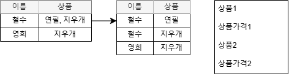

# 정규화(DB Normalization)의 개념
정규화는 관계형 데이터베이스의 설계에서 데이터 중복을 줄이고 데이터 무결성을 개선하기 위해 데이터를 정규형(normal form)에 맞도록 구조화하는 프로세스를 뜻한다.<a href="https://ko.wikipedia.org/wiki/%EB%8D%B0%EC%9D%B4%ED%84%B0%EB%B2%A0%EC%9D%B4%EC%8A%A4_%EC%A0%95%EA%B7%9C%ED%99%94">_위키백과</a>

## 정규화
- 데이터의 일관성, 최소한의 데이터 중복, 최대한의 데이터 유연성을 위한 과정
- 데이터의 중복을 제거하고 데이터 모델의 독립성 확보하는 과정
- 데이터 이상현상을 줄이기 위한 데이터 베이스 설계 기법
- 제1정규화부터 제5정규화까지 존재하나, 실질적으로 제3정규화까지만 수행

## 이상현상(Abnormality)
정규화가 되지 않아 발생하는 현상으로 테이블 수정(삽입, 갱신, 삭제)시 발생합니다.

### 삽입 이상
인스턴스가 삽입될 때 필요없는 속성까지 반드시 입력되어야 상황에서 삽입 이상 현상이 발생합니다.

예를 들면, 새로운 고용된 신입사원이 배정받은 부서가 없다고 가정해봅시다. 만약 부서코드를 식별자로 사용하는 테이블이라면, 부서코드가 빈 값이라는 이유로 새로운 신입 사원을 해당 테이블에 추가할 수 없게 됩니다. 

### 갱신 이상
데이터를 수정할 때, 관련 있는 모든 인스턴스에 대해 수정해야 합니다. 그러지 않았을 경우, 일부만 변경되었을 경우, 데이터의 모순이 발생합니다. 이러한 현상을 갱신 이상이라고 합니다.

### 삭제 이상
데이터를 삭제하고자 할 때, 불필요하게 다른 정보도 함께 삭제되는 것을 삭제 이상 현상이라고 합니다.

# 정규화 단계
## 제1정규형: 모든 속성은 반드시 하나의 값을 가져야 한다.
#### 제1정규화(1NF)
테이블의 컬럼이 원자성(한 속성이 하나의 값을 갖는 특성)을 갖도록 테이블을 분해하는 단계입니다. 다시 말해, 하나의 행과 칼럼의 값이 반드시 한 값만 입력되도록 행을 분리하는 것을 말합니다.

#### 예시

- 하나의 상품 칼럼에 두 개의 값이 입력되어 있으므로, 이를 각각 다른 행으로 분리
- 동일한 유형의 데이터가 여러 개의 속성으로 나열되어 있는 경우, 반복되는 속성을 별도의 행으로 분리

## 제2정규형: 엔터티의 일반 속성은 주식별자 전체에 종속적이어야 한다.
#### 제2정규화(2NF)
제1정규화를 진행한 테이블에 대해 완전 함수 종속을 만들도록 테이블을 분해하는 단계입니다. **완전 함수 종속**이란, 기본키의 부분집합이 결정자가 되어서는 안된다는 것을 의미합니다. 

> **결정자란?**
> 만약 A 속성이 B 속성의 값을 결정하게 되면, A는 B의 결정자라고 하며, 반대로 B는 A에 종속됩니다. 

#### 예시

이 테이블에서 기본키는 (학생번호, 강좌이름)으로 복합키입니다. 그리고 기본키는 성적을 결정하고 있습니다. 그런데 기본키의 부분집합인 강의명이 강의실을 결정짓고 있습니다. 따라서, 수강 테이블과 강의실 테이블로 분리하는 제2정규화 단계를 거쳐 제2정규형을 만족시킬 수 있습니다.

## 제3정규형: 엔터티의 일반속성 간에는 서로 종속적이지 않는다.
#### 제3정규화(3NF)
제2정규화를 진행한 테이블에 대해 이행적 종속을 없애도록 테이블을 분리하는 단계입니다. **이행적 종속**이란 A -> B, B -> C 의 관계가 성립할 때, A -> C 가 성립되는 것을 말합니다. 즉, (A,B)와 (B,C)로 분리하는 것이 제3정규화입니다.

#### 예시

고객번호에 의해 상품이 결정, 상품에 의해 가격이 결정되는데, 고객 번호에 의해서도 가격이 결정됩니다. 따라서 (고객번호+상품)과 (상품+가격)으로 분리하여 제3정규형을 만족시킬 수 있습니다.

## 기타 정규화
#### 1. BCNF(Boyce-Codd Normal Form) 정규화
- 모든 결정자가 후보키가 되도록 테이블을 분해하는 것으로 결정자가 후보키가 아닌 다른 컬럼에 종속되면 안됩니다.

#### 2. 제4정규화
- 여러 컬럼들이 하나의 컬럼을 종속시키는 경우 분해하여 다중값 종속성을 제거하는 것을 말합니다.

#### 3. 제5정규화
- 조인에 의해서 종속성이 발생되는 경우 분해하는 것을 말합니다.

# 반정규화와 성능
## 반정규화 = 역정규화(De-Normalization)의 개념
반정규화란 데이터베이스의 성능 향상을 위해 데이터 중복을 허용하고 조인을 줄이는 데이터베이스 성능 향상 방법입니다. 다시 말해, 시스템의 성능 향상, 개발 및 운영의 단순화를 위해 정규화된 데이터 모델을 중복, 통합, 분리하는 데이터 모델링 기법을 의미합니다.

## 반정규화 수행 케이스
다음과 같은 경우에 반정규화를 수행할 수 있습니다.
- 정규화에 충실하여 종속성, 활용성은 향상되지만 수행 속도가 느려지는 경우
- 다량의 범위를 자주 처리해야하는 경우
- 특정 범위의 데이터만 자주 처리하는 경우
- 요약/집계 정보가 자주 요구되는 경우